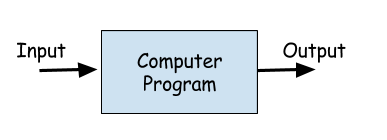

# Introduction to Coding 

# Tools

For this book or workshop, you will be using a couple of tools. 

You do NOT need to install any software on your computer. You can use all these tools within your web browser1. 

# Parts of a Computer Program

There are usually three parts to a program. What you give to the program as "input" or what you ask the computer program to do.

The computer "program" or `code` itself that is designed to achieve a result.

And the "output" or the result that comes out of the program.

- Input

  Input to a program is usually what you as a person could give to the program. In some cases the program may get its "input" from another program. 

  For a program that would like to convert distance from feet to meters the input could be a number that you give in feet. The Program itself does the conversion using feet-to-meters conversion on the given input. The Output would be simply printing out the result. 

- Program

  Comptuer Program is where all the code and the logic would stay to achieve a result. Most of the computer programs implement a certain set of steps or an `algorithm` to achieve a result. 

- Output

  Output is usually that comes out of a program and get displayed on the computer. It could be text or it could be things moving on the screen or images or movies.

1. Latest version of Chrome, Firefox, or Safari web browser is required.
